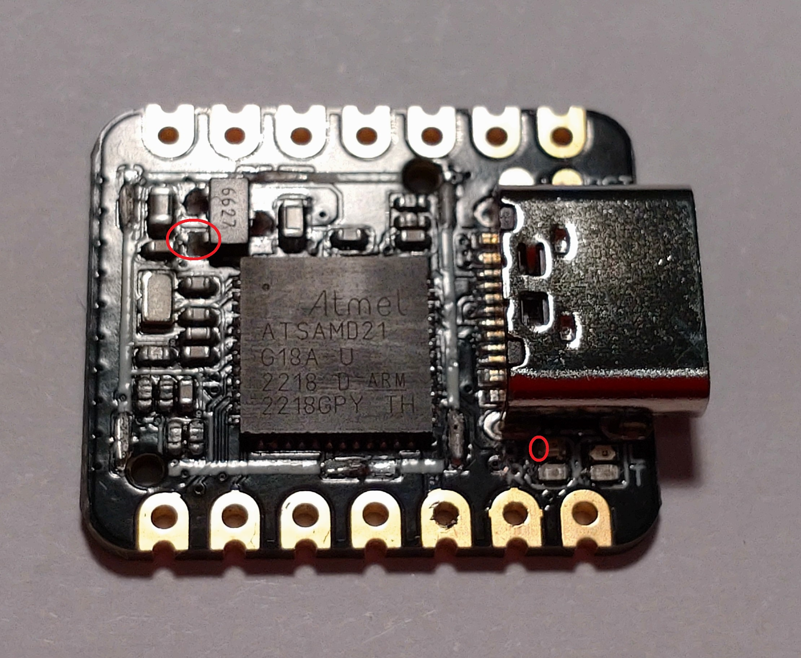

# Arduino Core for SAM D21 Low Power Extensions

Take Arduino low power projects for the SAM D21 to the next level.

### Table of contents

[1. Motivation](#motivation)  
[2. MCU Power Management](#mcu-power-management)  
[3. ADC, EIC, RTC and TC](#adc-eic-rtc-and-tc)  
[4. Seed Studio XIAO SAM D21](#seed-studio-xiao-sam-d21)  
[5. Documentation](#documentation)  
[6. Examples](#examples)  
[7. Recommended Reading](#recommended-reading)  
[8. Contributing](#contributing)  
[9. Licenses and Credits](#licenses-and-credits)  

## Motivation

There are already several libraries available for the SAM D21 MCU that support low power features:

- [Arduino Low Power library](https://github.com/arduino-libraries/ArduinoLowPower)
- [RTCZero Library for Arduino](https://github.com/arduino-libraries/RTCZero)

They provide solutions for specific use cases but fall short of making full use of the potential of the SAM D21 MCU. E.g. none of them tries to disable the USB module at runtime, the most power hungry function of the MCU, although typically not required for low power usage.

Another part of the problem is the rigid way the Arduino Core for SAM D21 bootstraps the MCU for 48 MHz with most MCU features enabled and configured for maximum performance. In contrast to classic Arduino MCUs like the Atmel ATmega 328 the SAM D21 MCU supports up to 9 clock sources at the same time, that may run in parallel at different frequencies. Using the generic clock controller (GCLK) the clocks can be selectively assigned to different MCU modules and can be stopped in standby mode. Combined with the power manager (PM) this allows disabling unused MCU modules and running the required MCU modules with clock frequencies that are optimized for the use case.

Although the main key, the power saving options of the SAM D21 are not exhausted by controlling clocks on the module level. The SAM D21 MCU has an ARM Cortex M0+ CPU core that knows an operation mode called [sleep-on-exit](https://community.arm.com/arm-community-blogs/b/architectures-and-processors-blog/posts/beginner-guide-on-interrupt-latency-and-interrupt-latency-of-the-arm-cortex-m-processors). This mode is useful if the application does not need a main loop but runs completely event/interrupt driven. This saves the CPU overhead for the double context switch between main loop, ISR and back, saving power and reducing ISR latency.

Most of the library code is not using the Arduino framework but the CMSIS-Core interface to access the MCU registers directly. Some methods of the API are variations of methods of the Arduino core SDK, the Arduino library RTCZero and the ArduinoLowPowerClass. Using the Arduino implementations directly will not provide the same results in regard to power saving because the Arduino framework is designed for ease of use.

For a quick start it will be enough to look into the [examples](examples) that have been included.

There are also individual hardware aspects of each board to consider that may adversely affect low power usage, like permanently powered LEDs or a reverse current into the voltage regulator.

Note that this library was designed and tested for the SAM D21 but will probably work with other SAM D variants with little or no adjustment, especially with the SAM DA1 variant.

## MCU Power Management

Well known from other CPUs and MCUs effective power management can be achieved by the combination of several aspects:

- **reducing clock frequencies**, as power consumption often has a linear relation to the clock frequency
- dynamically enabling and **disabling MCU features**
- making use of MCU specific **power management** features (e.g. sleep mode)
- **reducing supply voltage**

This library provides several functions for that purpose with the *SAM D21LPE::System* class. Using the the SAM D21 datasheet or looking into other documentation that is available online will you with the necessary background. 

The [System](src/System.h) class supports the following operations:

- configure the internal clock sources *OSCULP32K* and *OSC8M*
- disable any clock source
- enable/disable the clock of any MCU module including the power management of the internal MCU buses for the MCU modules *ADC*, *EIC*, *RTC*, *SERCOM0-5*, *TCC2-TC5* and *USB*
- enable/disable SysTick
- configure/enter sleep mode (idle 0-2 or standby)
- enable/disable sleep-on-exit ISR mode
- disable all non essential modules incl. *USB*
- read the MCU serial number

In this list the **reduction of the main clock** is not included. Changing this clock at any time is possible but in combination with the Arduino framework this is typically not a good choice as several Arduino libraries assume that the main clock frequency *F_CPU* is fixed at compile time. Changing it at runtime to a different value will result in the loss of various functions, especially everything that is timing related (e.g. millis() will no longer be real milliseconds). As the Arduino Core for SAM D21 only supports F_CPU fixed to 48 MHz, a patch if provided for [startup.c](patches/Seeduino-hardware-samd-1.8.3/startup.c) and [boards.txt](patches/Seeduino-hardware-samd-1.8.3/boards.txt) to support alternative values of 32, 24, 16, 12, 8, 6, 3 and 1.5 MHz. The provided patch is for the Seed Studio XIAO SAM D21, but this patch can also applied to any other SAM D21 MCU with no or little changes.

The SAM D21 *USB* module requires a clock of 48 MHz, although this does not have to be the main clock. Changing the main clock without setting up an alternative clock for the USB module will cause the USB operations to fail, so **disabling the *USB* module** is recommended, especially if low power consumption is required, as the active USB module uses 10.3 mA by itself at 3.3 V.

Using these functions, especially combined, can reduce the average runtime power significantly and allows to put the MCU into standby mode with a supply current of around 2 µA at 3 V.

## ADC, EIC, RTC, SERCOM and TC

Compared to the extensions included in the Arduino core for the ESP8266 the Arduino core for the SAM D21 is rather sparse. Three more classes are included in this library to provide several missing features:

| Class                   | Extensions             | 
| ----------------------- | ---------------------- | 
| Analog2DigitalConverter | Selectable Gain, Hardware Averaging, Temperature Sensor, Supply, Core and Bandgap Voltage, Callback | 
| RealTimeClock           | Counter Mode, Callback | 
| TimerCounter            | Callback               | 

The *RealTimeClock* class of this library provides RTC counter mode as an alternative to the calendar mode of the RTCZero library. The *Analog2DigitalConverter* class and the *TimerCounter* can be used alternatively or combined with Arduino framework functions if the documented conditions are observed.

The external interrupt controller (EIC) is one of the MCU modules where Arduino framework functions like attachInterrupt() can be used in the familiar way and the low power optimization can be achieved by a call to the *System* class.

On the other hand the SPI implementation of the Arduino Core for SAM D21 does not use *F_CPU* or *SystemCoreClock* for determining the SPI baud rate divider but a hardcoded value of 48000000 (*SERCOM_SPI_FREQ_REF*), preventing correct baud settings at alternative main clock frequencies. To work around this without changing the Arduino Core source it is necessary to scale the baud rate with the following formula:

*uint32_t configBaud = (uint64_t)spiBaud**SERCOM_SPI_FREQ_REF/F_CPU*

## Seed Studio XIAO SAM D21

MCU boards are typically created with a focus on features and not on low power operation.

The power consumption of the Seed Studio XIAO SAM D21 can be reduced significantly to values that are more or less identical to the datasheet specifications by the following hardware changes:

- cut PCB trace to power LED to save approximately 2 mA, best done near resistor on bottom side of board
- lift voltage regulator output pin from board when directly powering via pin 3V3 to prevent reverse current of approximately 14 µA (requires removing RF shield, can be pried loos after weakening soldering with cutter and can be reattached)

## Documentation

The documentation for each library class can be found in the respective header file:

- [System](src/System.h)
- [Analog2DigitalConverter](src/Analog2DigitalConverter.h)
- [RealTimeClock](src/RealTimeClock.h)
- [TimerCounter](src/TimerCounter.h)

## Examples

Examples for most of the features described above can be found in the [examples](examples) subdirectory.

## Recommended Reading

- [Microchip SAM D21/DA1 Family Datasheet DS40001882F](https://ww1.microchip.com/downloads/en/DeviceDoc/SAM_D21_DA1_Family_DataSheet_DS40001882F.pdf)
- [ARM Cortex-M0/M0+: Ultralow-power design](https://www.embedded.com/the-definitive-guide-to-arm-cortex-m0-m0-ultralow-power-designs/)
- [ARM Cortex-M0/M0+: Wake-up](https://www.embedded.com/the-definitive-guide-to-arm-cortex-m0-m0-wake-up-operation/)

## Contributing

Contributors are welcome. Please create a merge request if you want to fix a bug or add a feature.

## Licenses and Credits

### Documentation and Photos

Copyright (c) 2023 [Jens B.](https://github.com/jnsbyr)

### Source Code

Copyright (c) 2023 [Jens B.](https://github.com/jnsbyr)

The source code was edited and build using the [Arduino IDE](https://www.arduino.cc/en/software/), [Arduino CLI](https://github.com/arduino/arduino-cli) and [Microsoft Visual Studio Code](https://code.visualstudio.com).

The source code depends on:

#### Arduino SDK & Seed Studio SDK for SAM D21 and SAM D51

Copyright (C) 2014 [Arduino LLC](https://github.com/arduino/Arduino)

#### CMSIS Atmel

Copyright (C) 2015 [Atmel Corporation](https://github.com/arduino/ArduinoModule-CMSIS-Atmel)

Also many thanks to the Open Source community, the bloggers and the forum users that have shared their experience with the SAM D21 MCU.